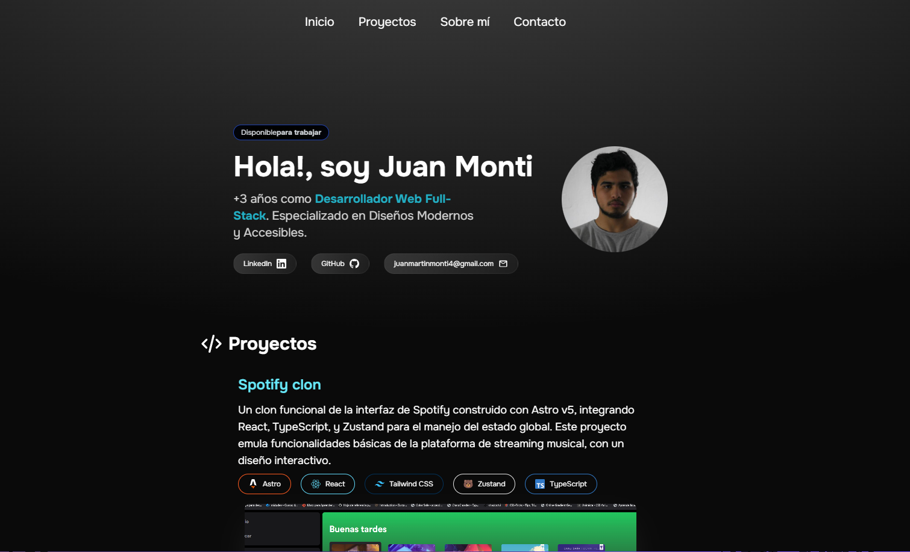

# Proyecto de Portafolio con Astro

[](https://personal-portfolio-omega-five-92.vercel.app/)

Este proyecto es un portafolio personal construido con Astro, Tailwind y Typescript.

## 🚀 Estructura del Proyecto

Dentro del proyecto, encontrarás las siguientes carpetas y archivos:

```text
/
├── public/
│   └── favicon.svg
├── src/
│   ├── assets/
│   ├── components/
│   ├── layouts/
│   ├── pages/
│   └── lib/
└── package.json
```

Para aprender más sobre la estructura de un proyecto Astro, consulta [la guía sobre estructura de proyectos](https://docs.astro.build/en/basics/project-structure/).

## 🧞 Comandos

Todos los comandos se ejecutan desde la raíz del proyecto, desde una terminal:

| Comando                   | Acción                                           |
| :------------------------ | :----------------------------------------------- |
| `pnpm install`             | Instala las dependencias                         |
| `pnpm run dev`             | Inicia el servidor de desarrollo en `localhost:4321` |
| `pnpm run build`           | Construye el sitio de producción en `./dist/`    |
| `pnpm run preview`         | Previsualiza tu construcción localmente, antes de desplegar |
| `pnpm run astro ...`       | Ejecuta comandos CLI como `astro add`, `astro check` |
| `pnpm run astro -- --help` | Obtén ayuda usando el CLI de Astro               |

## 🌟 Tecnologías Utilizadas

- **Astro**: Framework principal para la construcción del sitio.
- **Tailwind CSS**: Framework de CSS para el diseño.
- **TypeScript**: Lenguaje de programación para tipado estático.

## 📂 Datos del Proyecto

Los datos del proyecto, incluyendo enlaces a redes sociales y proyectos destacados, se encuentran en el archivo `src/lib/data.ts`.

## 👀 ¿Quieres saber más?

Siéntete libre de consultar [nuestra documentación](https://docs.astro.build) o unirte a nuestro [servidor de Discord](https://astro.build/chat).

## 🤝 Contribuir

Si deseas contribuir a este proyecto, por favor sigue estos pasos:

1. Haz un fork del repositorio.
2. Crea una nueva rama (`git checkout -b feature/nueva-funcionalidad`).
3. Realiza tus cambios y haz commit (`git commit -am 'Añadir nueva funcionalidad'`).
4. Sube tus cambios (`git push origin feature/nueva-funcionalidad`).
5. Abre un Pull Request.

¡Gracias por tu interés en contribuir!
